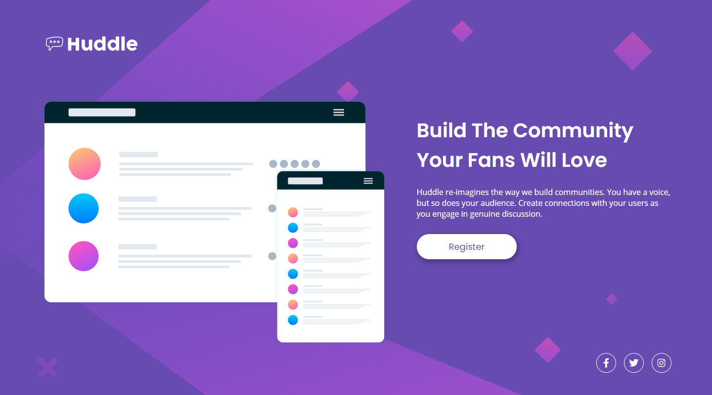
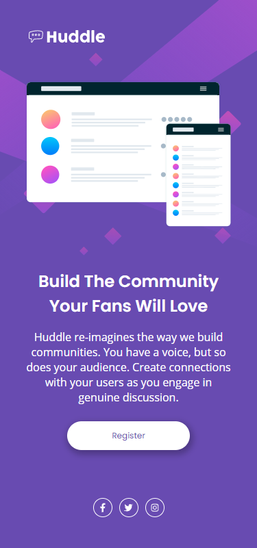

# Frontend Mentor - Huddle landing page with single introductory section

This is a solution to the [# Frontend Mentor - Huddle landing page challenge on Frontend Mentor](https://www.frontendmentor.io/challenges/huddle-landing-page-with-a-single-introductory-section-B_2Wvxgi0). Frontend Mentor challenges help you improve your coding skills by building realistic projects.

## Table of contents

- [Overview](#overview)
  - [The challenge](#the-challenge)
  - [Screenshot](#screenshot)
  - [Links](#links)
- [My process](#my-process)
  - [Built with](#built-with)
  - [What I learned](#what-i-learned)
- [Author](#author)

## Overview

### The challenge

Users should be able to:

- View the optimal layout for the page depending on their device's screen size
- See hover states for all interactive elements on the page

### Screenshot

### Links

- Solution URL: (https://www.frontendmentor.io/solutions/responsive-landing-page-with-tabbable-elements-ngqH7Wjju)
- Live Site URL: (https://lm-huddle-landing-page.netlify.app/)

## My process

### Built with

- Semantic HTML5 markup
- CSS custom properties/vars
- Desktop-first workflow

### What I learned

Learnt further/practiced making sure all elements are tabbable and have focus states. I also made sure the icons were accessible, so this project was less about the layout but more about making sure it was accessible.

## Author

- Website - [Leon Michalak](https://www.leonmichalak.tech)
- Frontend Mentor - [@NinjaInShade](https://www.frontendmentor.io/profile/NinjaInShade)
- Instagram - [@lmdeveloper](https://www.instagram.com/lmdeveloper/)
